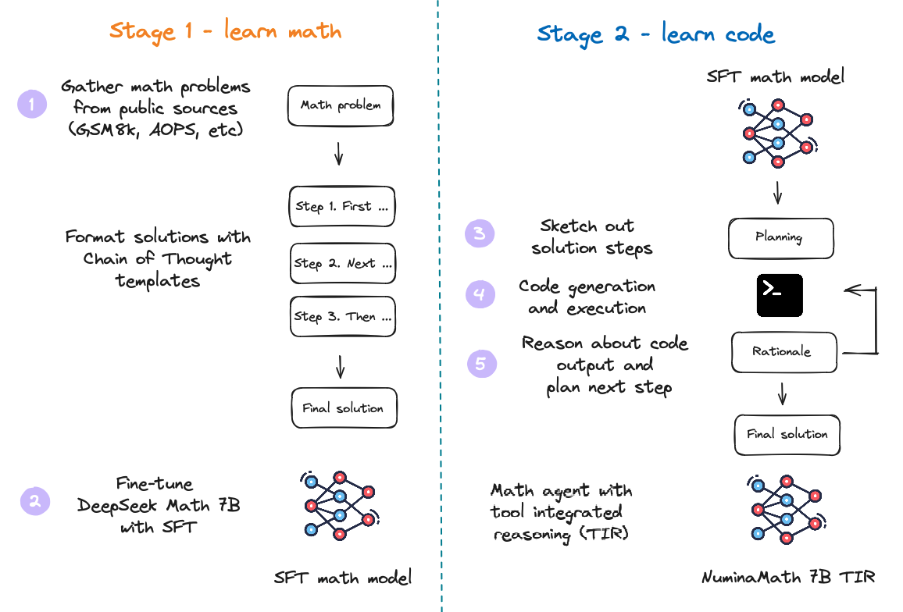

<!-- markdownlint-disable first-line-h1 -->
<!-- markdownlint-disable html -->
<!-- markdownlint-disable no-duplicate-header -->

<div align="center">
  
</div>

<p align="center">
    🌐 <a href="https://www.projectnumina.ai/">Website</a>&nbsp&nbsp | 🗂️ <a href="https://huggingface.co/collections/AI-MO/numinamath-6697df380293bcfdbc1d978c">Datasets</a>&nbsp&nbsp | &nbsp&nbsp 📑 <a href="https://github.com/project-numina/aimo-progress-prize/blob/main/report/numina_dataset.pdf">Dataset Technical Report</a> &nbsp&nbsp 
<br>
        🤗 <a href="https://huggingface.co/AI-MO">Hugging Face</a>&nbsp&nbsp | &nbsp&nbsp🤗 <a href="https://huggingface.co/blog/winning-aimo-progress-prize">Blog post</a>&nbsp&nbsp |  &nbsp&nbsp🖥️ <a href="https://huggingface.co/spaces/AI-MO/math-olympiad-solver">Demo</a> 
</p>
<br><br>

## Numina Solution to the 1st AIMO Progress Prize

<div align="center">
  
</div>


This repository contains the training and inference code needed to replicate our winning solution to the [AI Mathematical Olympiad - Progress Prize 1](https://www.kaggle.com/competitions/ai-mathematical-olympiad-prize). 

Our solution consisted of four main components:

* A recipe to fine-tune [DeepSeekMath-Base 7B](https://huggingface.co/deepseek-ai/deepseek-math-7b-base) to solve mathematical problems using tool-integrated reasoning (TIR)
* Two high-quality training datasets of ~1M math problems and solutions
* A self-consistency decoding algorithm to generate solution candidates with code execution feedback (SC-TIR)
* Four carefully chosen validation sets from AMC, AIME, and MATH to guide model selection and avoid overfitting to the public leaderboard

We used a mix of open-source libraries to train our models, notably TRL, PyTorch, vLLM, and DeepSpeed. On one node of 8 x H100 GPUs, our models took 10 hours to train. You can find the datasets and models on the Hugging Face Hub under the [NuminaMath collection](https://huggingface.co/collections/AI-MO/numinamath-6697df380293bcfdbc1d978c).

## How to navigate this project

This project is simple by design and mostly consists of:

* [`training`](./training): scripts to fine-tune and quantize models.
* [`kaggle-solution`](kaggle-solution.ipynb): a notebook with the SC-TIR inference code we used during Kaggle submissions.

## Installation instructions

To run the code in this project, first, create a Python virtual environment using e.g. Conda:

```shell
conda create -n aimo python=3.10 && conda activate aimo
```

Next, install PyTorch `v2.1.2` - the precise version is important for reproducibility! Since this is hardware-dependent, we direct you to the [PyTorch Installation Page](https://pytorch.org/get-started/previous-versions/#v212).

You can then install the remaining package dependencies as follows:

```shell
pip install -r requirements.txt
```

You will also need Flash Attention 2 installed, which can be done by running:

```shell
python -m pip install flash-attn --no-build-isolation
```

> Note: If your machine has less than 96GB of RAM and many CPU cores, reduce the MAX_JOBS arguments, e.g. MAX_JOBS=4 pip install flash-attn --no-build-isolation

Next, log into your Hugging Face account as follows:

```shell
huggingface-cli login
```

Finally, install Git LFS so that you can push models to the Hugging Face Hub:

```shell
sudo apt-get install git-lfs
```

## Training methodology

Training is conducted in two stages, following the [MuMath-Code recipe](https://arxiv.org/abs/2405.07551):

- **Stage 1** Chain of Thought (CoT) training on math problems and text solutions.
- **Stage 2** Tool Integrated Reasoning (TIR) training on math problems and code solutions.

<div align="center">
  
</div>

## Datasets

We used two datasets to fine-tune our model:

* **[NuminaMath-CoT](https://huggingface.co/datasets/AI-MO/NuminaMath-CoT):** Approximately 860k math problems, where each solution is formatted in a Chain of Thought (CoT) manner. The sources of the dataset range from Chinese high school math exercises to US and international mathematics olympiad competition problems. The data were primarily collected from online exam paper PDFs and mathematics discussion forums. The processing steps include (a) OCR from the original PDFs, (b) segmentation into problem-solution pairs, (c) Translation into English, (d) realignment to produce a CoT reasoning format, and (e) final answer formatting.
* **[NuminaMath-TIR](https://huggingface.co/datasets/AI-MO/NuminaMath-TIR):** Tool-integrated reasoning (TIR) plays a crucial role in this competition. However, collecting and annotating such data is both costly and time-consuming. To address this, we selected approximately 70k problems from the NuminaMath-CoT dataset, focusing on those with numerical outputs, most of which are integers. We then utilized a pipeline leveraging GPT-4 to generate TORA-like reasoning paths, executing the code and producing results until the solution was complete. We filtered out solutions where the final answer did not match the reference and repeated this process three times to ensure accuracy and consistency. This iterative approach allowed us to generate high-quality TORA data efficiently.

## Training the models

As described above, training the model proceeds in two steps:

1. Apply SFT to fine-tune [DeepSeekMath-Base 7B](https://huggingface.co/deepseek-ai/deepseek-math-7b-base) on the `[NuminaMath-CoT](https://huggingface.co/datasets/AI-MO/NuminaMath-CoT)` dataset. The result is an SFT model like [`NuminaMath-7B-CoT`](https://huggingface.co/AI-MO/NuminaMath-7B-CoT).
2. Fine-tune the SFT model from Stage 1 to learn tool-integrated reasoning on the [`NuminaMath-TIR`](https://huggingface.co/datasets/AI-MO/NuminaMath-TIR) dataset. The result is a "reasoning agent" like [`NuminaMath-7B-TIR`](https://huggingface.co/AI-MO/NuminaMath-7B-TIR).
  
See below for commands to train these models using DeepSpeed ZeRO-3. Note you will require 8 GPUs with 80GB of VRAM to train the full model with our settings.

### Stage 1

```shell
accelerate launch --config_file=training/configs/deepspeed_zero3.yaml training/sft.py training/configs/stage-1-cot.yaml
```

### Stage 2

```shell
accelerate launch --config_file=training/configs/deepspeed_zero3.yaml training/sft.py training/configs/stage-2-tir.yaml
```

## Post-training quantization

Once the model has been trained, we quantized it to 8-bit precision with AutoGPTQ in order to improve performance with vLLM on Kaggle's T4 GPUs (as they do not support bfloat16 types). This step is optional and the model should have better performance when loaded in 16-bit precision:

```shell
python training/quantization.py --model_id AI-MO/NuminaMath-7B-TIR --calibration_dataset data/NuminaMath-TIR
```

## Project structure

```
aimo-progress-prize/
├── LICENSE
├── README.md               <- The top-level README for developers using this project
├── images
├── kaggle-solution.ipynb   <- Notebook with inference code used in our Kaggle submissions
├── requirements.txt        <- Project dependencies
└── training
    ├── configs             <- Hyperparameter configs for training
    ├── numina              <- Source code for use in this project
    ├── quantization.py     <- Script to quantize model with AutoGPTQ
    └── sft.py              <- Script to fine-tune our models
```

## Hardware (The following specs were used to create the original solution)

### OS

```
NAME="Ubuntu"
VERSION="20.04.6 LTS (Focal Fossa)"
ID=ubuntu
ID_LIKE=debian
PRETTY_NAME="Ubuntu 20.04.6 LTS"
VERSION_ID="20.04"
HOME_URL="https://www.ubuntu.com/"
SUPPORT_URL="https://help.ubuntu.com/"
BUG_REPORT_URL="https://bugs.launchpad.net/ubuntu/"
PRIVACY_POLICY_URL="https://www.ubuntu.com/legal/terms-and-policies/privacy-policy"
VERSION_CODENAME=focal
UBUNTU_CODENAME=focal
```

### GPU

One node of 8 x H100s, each with 80GB VRAM and 96 CPUs with 1TB RAM.

## Software (Python packages are detailed separately in `requirements.txt`):

* Python 3.10.14
* CUDA 12.2
* Nvidia drivers v.535.104.12
