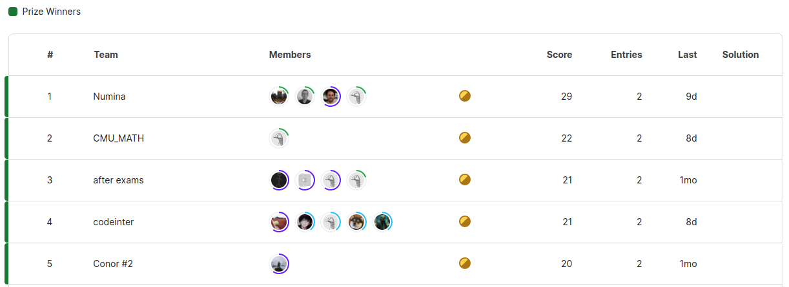

<!-- markdownlint-disable first-line-h1 -->
<!-- markdownlint-disable html -->
<!-- markdownlint-disable no-duplicate-header -->

<div align="center">
  
</div>

<p align="center">
    [small logo] <a href="https://www.projectnumina.ai/">Website</a>&nbsp&nbsp
<br>
        🤗 <a href="https://huggingface.co/AI-MO">Hugging Face</a>&nbsp&nbsp | &nbsp&nbsp🤗 <a href="https://huggingface.co/AI-MO">Blog post</a>&nbsp&nbsp | &nbsp&nbsp 📑 <a href="https://arxiv.org/abs">Dataset Technical Report</a> &nbsp&nbsp ｜ &nbsp&nbsp🖥️ <a href="https://huggingface.co/spaces/AI-MO/math-olympiad-solver-by-api">Demo</a> 
</p>
<br><br>

## Introduction

- explain the mission of numina
- explain the AIMO progress prize

<div align="center">
  
</div>

## Datasets

- numina-dataset-1.0
- numina-dataset-tora-1.0

## Training the models
First create a conda venv and install the requirements:

```shell
conda create -n aimo python=3.10 && conda activate aimo
pip install -R requirements.txt
```

Training is conducted in two stages:
- **Stage 1** Chain of Thought (CoT) training on math problems and text solutions.
- **Stage 2** Tool Integrated Reasoning (TIR) training on math problems and code solutions.

The following commands should be run on a 8xA100 node:
### Stage 1 (you will need to open the [config yaml file](training/configs/config_aimo_cot.yaml) and change <ORG> to your hub organization)

```shell
accelerate launch training/configs/deepspeed_zero3.yaml training/sft.py training/recipe/config_aimo_cot.yaml
```

### Stage 2 (you will need to open the [config yaml file](training/configs/config_aimo_tora.yaml) and change <ORG> to your hub organization)
```shell
accelerate launch training/configs/deepspeed_zero3.yaml training/sft.py training/recipe/config_aimo_tir.yaml
```

Alternatively, we provide a slurm script for queuing training on a cluster:
### Stage 1:
```
sbatch training/launch_sft.slurm training/configs/config_aimo_cot.yaml
```
### Stage 2:
```
sbatch training/launch_sft.slurm training/configs/config_aimo_tir.yaml
```

Once the model has been training, we quantized to 8 bits in order to improve performance with vllm on T4 GPUs, as they do not support bf16 types. This step is option, the model should have better performance when loaded in bf16.
```
python training/quantization.py --model_id <ORG>/deepseek-math-7b-sft --revision numina-math-tir --calibration_dataset AI-MO/tora-chosen-v0.7
```